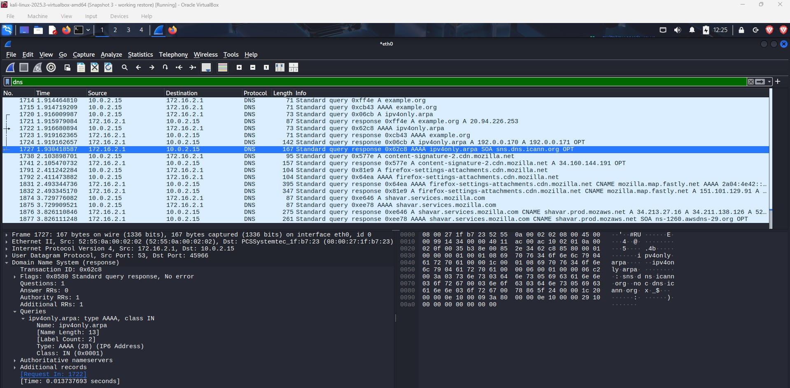

# Screenshots

Screenshots to be added:

## Packet Capture Analysis

Wireshark packet capture showing TCP/TLS traffic analysis with protocol inspection and packet-level details.

## DNS Request Inspection

Wireshark DNS traffic analysis showing query and response inspection used during network investigations.

- TCP stream analysis
- Network investigation workflow
